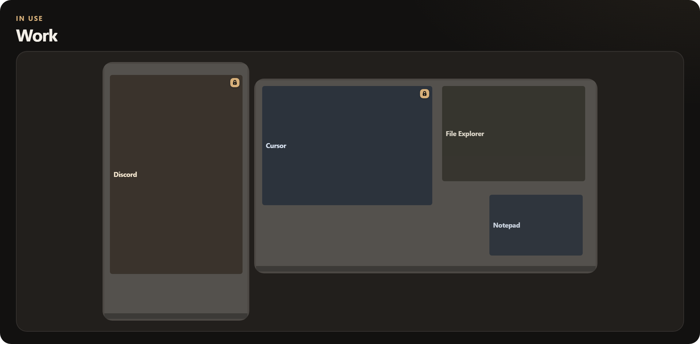
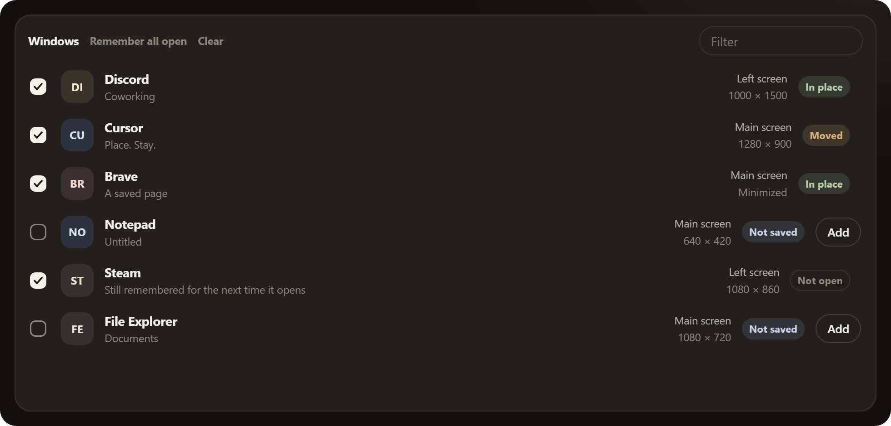
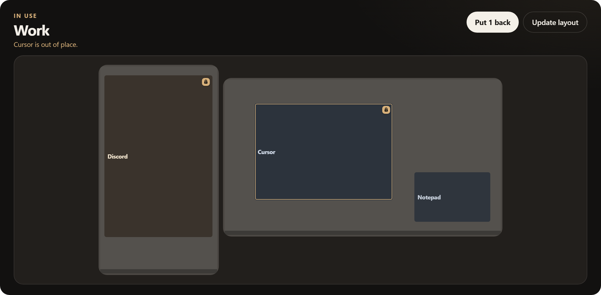

# Place. Stay.

Place. Stay. is a Windows app for a desk with more than one screen. You put each window where it belongs. Next time those apps open, they come back here.

It is a dog command. Place: go to your spot. Stay: do not wander off. Discord on the left. Cursor on the main screen. A browser where you left it.

Windows 10 and 11. Not affiliated with Microsoft.

  

  

## What you get

A map of your screens, and a list of what is open. Check the windows that matter. Save that as a layout. Give it a name you will recognize later.

**Put windows back.** One button. Saved apps return to the screens you chose. Other windows can sit wherever you put them until you press Add.

**When saved apps open.** Turn this on and each saved window is moved once, onto its screen. Drag it afterward and it stays where you dragged it. It is not glued there.

**Start when I sign in.** It waits in the tray. It can put windows back, including ones already open.

Ink and Paper themes. A desktop shortcut if you want one. Close the window and it hides in the tray. Quit from there, or from the app.

## How you use it

1. Open the apps you care about. Put each window on the screen it belongs on.
2. Press **Save this desktop**, or check windows and save a layout.
3. Next time the desk is a mess, press **Put windows back**.

Save more than one layout if your desk changes: work, evening, a second monitor at home.

  

## Install

Windows 10 or 11. Most PCs already have Edge WebView2. If Setup asks for it, let it install.

**Try it from this folder.** Double-click `run.bat`. The first run makes a Python environment and installs what it needs.

**Make the installer.** Double-click `build.bat`. You get `installer\out\PlaceStay-1.0.0-Setup.exe`. That Setup file is what people will download from Releases once this is public.

You do not install Python to use the Setup file. You do need Python 3 to run from source or to build.

**Uninstall.** Use Apps in Windows Settings. Saved layouts stay in your user folder: `%APPDATA%\PlaceStay`.

## Support

I'm Ryan Dunham, from Louisiana. I created Pie Eyed Handpies: the recipes, a truck I built out, a kitchen I put together. That truck is at Le Chien Brewing Co now, where I helped get things going and still pitch in. I'm trying to make it again with software.

I work with AI coding agents. I describe the idea, they help write it, and I decide what ships. [PasteFlick](https://github.com/HeadAroundIt/pasteflick) was my first public release. Place. Stay. is next.

If this helped you, consider supporting my work. A $5 tip helps pay for my development time, fixes, testing, and future tools.

  

Optional. Other amounts are welcome. Sharing Place. Stay. with someone who'd use it helps too.

## Privacy

The app looks at open windows on this PC so it can put them back. Layouts are saved in your Windows user folder. There is no account and no cloud.

Nothing about your windows is sent to me. The tip button opens Ko-fi.

Repo: [github.com/HeadAroundIt/place-stay](https://github.com/HeadAroundIt/place-stay)
